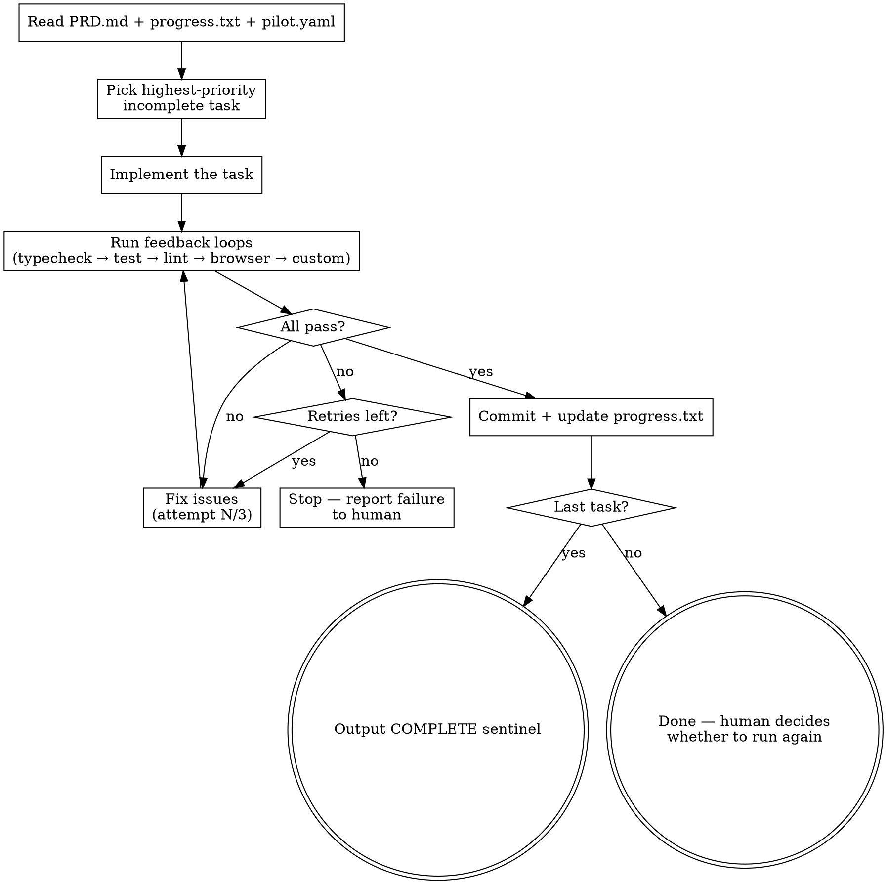

# PILOT Plugin Implementation Plan

> **For Claude:** REQUIRED SUB-SKILL: Use superpowers:executing-plans to implement this plan task-by-task.

**Goal:** Implement the three SKILL.md files and bash script that make the PILOT Claude Code plugin functional.

**Architecture:** Three skills (`plan`, `once`, `afk`) as SKILL.md files with YAML frontmatter, plus one bash script (`afk-loop.sh`). Each skill is a set of instructions that Claude follows when invoked. The plan skill is the most complex (multi-phase interactive), once is a strict execution discipline, and afk is a thin launcher.

**Tech Stack:** Claude Code SKILL.md format, YAML frontmatter, Bash

---

### Task 1: Write the `afk-loop.sh` bash script

**Files:**
- Create: `scripts/afk-loop.sh`

**Step 1: Write the script**

```bash
#!/bin/bash
set -e

# PILOT — Plan, Iterate, Loop, Observe, Test
# AFK autonomous loop script
# Usage: ./afk-loop.sh [iterations] [--sandbox]

ITERATIONS=${1:-20}
SANDBOX=false

for arg in "$@"; do
  case $arg in
    --sandbox) SANDBOX=true ;;
  esac
done

CLAUDE_CMD="claude"
if [ "$SANDBOX" = true ]; then
  CLAUDE_CMD="docker sandbox run claude"
fi

PROMPT='@PRD.md @progress.txt @.claude/pilot.yaml
You are PILOT — an autonomous coding agent running in AFK mode.

1. Read the PRD, progress file, and pilot config.
2. Find the highest-priority INCOMPLETE task (unchecked checkbox).
3. Implement it fully — write code, follow existing patterns in the codebase.
4. Run ALL feedback loops listed in pilot.yaml (in order: typecheck, test, lint, browser, custom).
5. If any feedback loop fails, fix the issue and retry (up to 3 attempts per loop).
6. If still failing after retries, skip this task, note the failure in progress.txt, and move to the next task.
7. Only commit if ALL feedback loops pass.
8. After each task, append a concise entry to progress.txt: task ref, files, decisions, feedback results, commit hash. Sacrifice grammar for concision.
9. Include progress.txt and PRD.md in every commit — they belong in git history.
10. If ALL tasks in the PRD are complete, output exactly: <promise>COMPLETE</promise>

CRITICAL: Only work on ONE task per iteration. Do not batch multiple tasks.'

for ((i=1; i<=$ITERATIONS; i++)); do
  echo ""
  echo "============================================"
  echo "  PILOT — Iteration $i / $ITERATIONS"
  echo "============================================"
  echo ""

  result=$($CLAUDE_CMD --permission-mode acceptEdits -p "$PROMPT")

  echo "$result"

  if [[ "$result" == *"<promise>COMPLETE</promise>"* ]]; then
    echo ""
    echo "============================================"
    echo "  PILOT complete after $i iterations."
    echo "============================================"
    exit 0
  fi
done

echo ""
echo "============================================"
echo "  Reached iteration cap ($ITERATIONS)."
echo "  Review progress.txt for status."
echo "============================================"
```

Write this to `scripts/afk-loop.sh`.

**Step 2: Make it executable**

Run: `chmod +x scripts/afk-loop.sh`

**Step 3: Commit**

```bash
git add scripts/afk-loop.sh
git commit -m "feat: add afk-loop.sh autonomous execution script"
```

---

### Task 2: Write the `/pilot:plan` skill (planning)

This is the most complex skill — multi-phase interactive planning that generates PRD + config.

**Files:**
- Create: `skills/plan/SKILL.md`

**Step 1: Write the SKILL.md**

The skill must follow these conventions:
- YAML frontmatter with `name` and `description` only
- Description starts with "Use when..." and focuses on triggering conditions
- Body uses markdown sections, tables, flowcharts (dot syntax) only for non-obvious decisions
- Multi-phase interactive pattern: announce → gather context → ask questions → generate artifacts

Write the following content to `skills/plan/SKILL.md`:

```markdown
---
name: plan
description: Use when starting a new development workflow, setting up autonomous coding loops, or preparing a codebase for PILOT execution. Triggers on project setup, PRD generation, toolchain detection, feedback loop configuration.
---

# PILOT Plan — Interactive Setup

**Announce at start:** "Using PILOT to set up your autonomous development workflow."

Generate a PRD, detect your toolchain, identify feedback loop gaps, and configure PILOT — all through guided questions.

## Checklist

You MUST complete these phases in order:

1. **Context scan** — detect stack, toolchain, existing config
2. **Gap analysis** — identify missing feedback loops, research + recommend tools
3. **Task source** — gather tasks from user, GitHub Issues, or both
4. **Generate artifacts** — PRD.md, .claude/pilot.yaml, progress.txt, afk-loop.sh
5. **Readiness check** — dry-run feedback loops, flag issues

## Phase 1 — Context Scan

Scan the repo to detect the development stack. Check for these files:

| File | Detects |
|------|---------|
| `package.json` | Node.js, dependencies, scripts (test, lint, typecheck, build) |
| `tsconfig.json` | TypeScript, compiler options |
| `vitest.config.*` | Vitest test runner |
| `jest.config.*` | Jest test runner |
| `playwright.config.*` | Playwright browser tests |
| `cypress.config.*` | Cypress browser tests |
| `.eslintrc*` / `eslint.config.*` | ESLint linter |
| `biome.json` / `biome.jsonc` | Biome linter/formatter |
| `pyproject.toml` | Python, pytest, ruff, mypy |
| `Cargo.toml` | Rust, cargo test, clippy |
| `go.mod` | Go, go test, golangci-lint |
| `Makefile` | Build commands, test targets |
| `.github/workflows/*` | CI config (reveals test/lint/typecheck commands) |

Also check:
- `package.json` scripts for `test`, `typecheck`, `lint`, `check`, `build` commands
- Existing `PRD.md`, `.claude/pilot.yaml`, `CLAUDE.md`
- GitHub Issues (if `gh` CLI is available: `gh issue list --limit 20`)

**Output:** Present a summary of what was detected:
```
Detected stack:
  Language: TypeScript
  Framework: Next.js 15
  Test runner: Vitest (vitest.config.ts)
  Typecheck: tsc --noEmit (tsconfig.json)
  Linter: ESLint (eslint.config.js)
  Formatter: Prettier (.prettierrc)
  Browser tests: not detected
  CI: GitHub Actions (.github/workflows/ci.yml)
```

## Phase 2 — Gap Analysis + Recommendations

Map the detected toolchain against the four core feedback loops:

| Feedback Loop | Purpose | Required For |
|---------------|---------|-------------|
| `typecheck` | Catch type errors before runtime | All typed languages |
| `test` | Verify behavior, catch regressions | All code changes |
| `lint` | Enforce style, catch bugs | All code changes |
| `browser` | Verify rendered UI | Frontend/UI tasks |

For each **missing** feedback loop:
1. Use WebSearch to find the best current tool for the detected stack
2. Present the gap with a recommendation as a question (one at a time):

Example questions:
- "No test runner detected. For this Next.js 15 + TypeScript project, **Vitest with jsdom** is the standard choice. Add test setup as the first PRD task?"
- "No linter found. For ESM TypeScript, **Biome** is fastest (lint + format in one tool), or **ESLint** if you need the plugin ecosystem. Which do you prefer?"
- "No type checking configured. You have `.js` files — want to add `tsconfig.json` with `checkJs: true`, or convert to TypeScript?"

If a gap exists but isn't relevant to the planned work (e.g., no browser tests but the work is purely backend), note it in the config but don't push setup:
```yaml
gaps:
  - browser: "No browser tests. Backend-only work — not needed for current PRD."
```

## Phase 3 — Task Source

Ask the user one question at a time:

**Question 1:** "Where should tasks come from?"
- Options: Local (describe what to build), GitHub Issues, Both

**Question 2:** "How should completed tasks be delivered?"
- Options: Commit directly to current branch (default, good for solo work), Create a branch + PR per task (good for teams with review processes)

**If Local:**
- Ask: "What are we building? Describe the feature, fix, or goal."
- Break the response into atomic tasks (one logical change each)
- Prioritize: gap-filling setup tasks first, then architectural/risky tasks, then standard features, then polish

**If GitHub Issues:**
- Run: `gh issue list --limit 30 --state open`
- Present the issues and let user select which to include
- Ask about priority ordering

**If Both:**
- Combine: GitHub Issues as backlog + user description for immediate focus

**For each task, generate:**
```markdown
- [ ] **Task N:** [Clear description]
  - Validation: [What feedback loops verify this]
  - Files: [Expected files to create/modify, if known]
```

**Prioritization order (from RALPH):**
1. Toolchain setup (gap-filling) — must be first
2. Architectural decisions and abstractions
3. Integration points between modules
4. Unknown unknowns and spike work
5. Standard features
6. Polish and quick wins

## Phase 4 — Generate Artifacts

Generate all four files. Use the Write tool for each.

**File 1: `PRD.md`**
```markdown
# [Project/Feature Name] — PRD

> Generated by PILOT on [date]. Edit freely — PILOT reads this on every iteration.

## Tasks

- [ ] **1.** [First task]
  - Validation: [feedback loops]
  - Files: [expected files]

- [ ] **2.** [Second task]
  - Validation: [feedback loops]
  - Files: [expected files]

[...continue for all tasks]

## Quality Bar

[From user's quality preference: prototype/production/library]

## Notes

[Any architectural decisions, constraints, or context from the planning conversation]
```

**File 2: `.claude/pilot.yaml`**
```yaml
# Auto-generated by /pilot:plan — edit if needed
project:
  name: [detected or asked]
  stack: [detected languages, frameworks]
  detected: [today's date]

source:
  type: [local | github | both]
  github:
    repo: [owner/repo or null]
    labels: [selected labels or empty]
    milestone: [selected milestone or null]

feedback:
  typecheck: [detected command or null]
  test: [detected command or null]
  lint: [detected command or null]
  browser: [detected command or null]
  custom: []

gaps: [list of {loop: reason} or empty]

loop:
  type: feature
  output: commit                 # commit (default) | pr (branch + PR per task)
  iterations: 20
  sandbox: true
  retries: 3

quality:
  bar: [prototype | production | library]
  notes: [user's quality notes or "Follow existing patterns."]
```

**File 3: `progress.txt`**
```
# PILOT Progress Log — generated [date]
# Appended after each iteration. Committed to git. Delete after sprint.
```

**File 4: `afk-loop.sh`**

Copy the script from the plugin's `scripts/afk-loop.sh` into the project root. Make it executable.

Run: `cp ${CLAUDE_SKILL_DIR}/../../scripts/afk-loop.sh ./afk-loop.sh && chmod +x afk-loop.sh`

If `${CLAUDE_SKILL_DIR}` is not available, write the script inline (see scripts/afk-loop.sh in the plugin repo for the canonical version).

## Phase 5 — Readiness Check

For each configured feedback loop, do a dry run:

```bash
# Example for a TypeScript + Vitest project:
tsc --noEmit          # Should exit 0 or show only pre-existing errors
vitest run            # Should exit 0 (or show only pre-existing failures)
biome check .         # Should exit 0 or show only pre-existing issues
```

Report results:
- All pass → "PILOT is ready. Run `/pilot:once` to start, or `/pilot:afk` to go autonomous."
- Some fail → "These feedback loops have pre-existing failures: [list]. Fix these first, or they'll block every iteration."
- Missing command → "Command `[cmd]` not found. Install it or update `.claude/pilot.yaml`."

## After Setup

Present the user with next steps:
```
PILOT setup complete!

Generated:
  PRD.md              — [N] tasks, prioritized
  .claude/pilot.yaml  — toolchain config
  progress.txt        — ready for iteration logs
  afk-loop.sh         — autonomous loop script

Next:
  /pilot:once         — run one task (recommended to start)
  /pilot:afk          — launch autonomous loop

Tip: Start with /pilot:once for 5-10 iterations to verify
feedback loops catch issues before going AFK.
```
```

Write this to `skills/plan/SKILL.md`.

**Step 2: Verify frontmatter**

Read the file back and confirm:
- `name: plan` (no special characters)
- `description` starts with "Use when..."
- No workflow summary in description

**Step 3: Commit**

```bash
git add skills/plan/SKILL.md
git commit -m "feat: add /pilot:plan skill — interactive setup and PRD generation"
```

---

### Task 3: Write the `/pilot:once` skill (HITL execution)

**Files:**
- Create: `skills/once/SKILL.md`

**Step 1: Write the SKILL.md**

This is a discipline-enforcing skill — strict execution rules with rationalization counters.

Write the following content to `skills/once/SKILL.md`:

```markdown
---
name: once
description: Use when executing a single task from a PILOT PRD, implementing one feature or fix with feedback loop validation before committing. Triggers on iterative development, task execution, PRD-driven coding.
---

# PILOT Once — Execute One Task

Implement exactly one task from the PRD, validate with feedback loops, commit only if all pass.

**Announce at start:** "Running PILOT — picking the next task from PRD.md."

## Prerequisites

Before running, these files MUST exist:
- `PRD.md` — task backlog with checkboxes
- `.claude/pilot.yaml` — feedback loop config
- `progress.txt` — iteration log

If any are missing, tell the user: "Run `/pilot:plan` first to set up PILOT."

## The Loop



## Step-by-Step Execution

### 1. Read Context

Read these three files:
- `PRD.md` — find the first unchecked (`- [ ]`) task
- `progress.txt` — understand what's already been done, what decisions were made
- `.claude/pilot.yaml` — know which feedback loops to run and the quality bar

### 2. Pick One Task

Select the **first unchecked task** in the PRD. Do not skip ahead. Do not batch multiple tasks.

If the task has dependencies on incomplete tasks above it, note this and attempt it anyway — the feedback loops will catch real blockers.

### 3. Implement

Write the code to complete the task. Follow these rules:
- **Read before writing** — understand existing patterns before adding code
- **Follow the codebase style** — match indentation, naming, structure
- **Respect the quality bar** from `pilot.yaml` (prototype vs production vs library)
- **One logical change** — don't scope-creep into adjacent improvements

### 4. Run Feedback Loops

Run each configured feedback loop from `pilot.yaml` **in order**:

```bash
# Read commands from pilot.yaml, skip null entries
# Example:
tsc --noEmit           # typecheck
vitest run             # test
biome check .          # lint
npx playwright test    # browser (if configured)
# ...any custom commands
```

**Rules:**
- Run ALL configured loops, not just the ones you think are relevant
- A loop "passes" if the command exits with code 0
- Pre-existing failures that existed before your changes do NOT count as your failure — but note them

### 5. Handle Failures

If a feedback loop fails:
1. Read the error output carefully
2. Fix the issue in your code
3. Re-run the failing loop
4. Retry up to **3 times per loop**
5. If still failing after 3 attempts: **STOP**

When stopping on failure:
- Do NOT commit broken code
- Report exactly what failed and why
- Suggest what the human should look at
- Append a failure entry to progress.txt

### 6. Commit

Only after ALL feedback loops pass. Check `pilot.yaml` for `loop.output` mode:

**If `output: commit` (default):**

```bash
git add [specific files you changed] progress.txt PRD.md
git commit -m "[type]: [description of what this task accomplished]"
```

**If `output: pr`:**

```bash
git checkout -b pilot/task-[N]-[short-description]
git add [specific files you changed] progress.txt PRD.md
git commit -m "[type]: [description of what this task accomplished]"
git push -u origin pilot/task-[N]-[short-description]
gh pr create --title "[type]: [description]" --body "PILOT automated PR for PRD #[N]"
git checkout [original branch]
```

Use conventional commit types: `feat`, `fix`, `refactor`, `test`, `chore`, `docs`.

**Never use `git add .` or `git add -A`** — only add files you intentionally changed (plus progress.txt and PRD.md).

### 7. Update Progress

Keep entries concise. Sacrifice grammar for the sake of concision. This file helps future iterations skip exploration.

Append to `progress.txt`:

```markdown
## [N] — PRD #[N]: [Task description]
files: [list of files created/modified]
decisions: [key decisions, terse]
feedback: typecheck ✓ test ✓ lint ✓
commit: [short hash]
```

For failures:
```markdown
## [N] — PRD #[N]: [Task description]
status: FAILED — [which loop]
error: [concise error description]
attempted: [what you tried]
needs: [what the human should look at]
```

### 8. Commit Progress

Include `progress.txt` in the commit — it belongs in git history:

```bash
git add [changed files] progress.txt PRD.md
git commit -m "[type]: [description]"
```

### 10. Update PRD

Check off the completed task in PRD.md:
```markdown
- [x] **Task N:** [description]
```

### 11. Check Completion

If ALL tasks in the PRD are checked off, output exactly:
```
<promise>COMPLETE</promise>
```

Otherwise, report what was done and stop. The human (or afk-loop.sh) decides whether to continue.

## Red Flags — STOP and Reconsider

| Thought | Reality |
|---------|---------|
| "I'll do this task AND the next one" | One task per iteration. Context rot is real. |
| "The tests are close enough" | Feedback loops are pass/fail. No "close enough." |
| "I'll commit now and fix the test later" | No commit without green. This is non-negotiable. |
| "This pre-existing failure is blocking me" | Note it, work around it, or escalate. Don't ignore it. |
| "I'll skip the lint check, it's just style" | Run ALL configured loops. The config exists for a reason. |
| "Let me also refactor this nearby code" | One logical change. Stay on task. |
```

Write this to `skills/once/SKILL.md`.

**Step 2: Verify frontmatter**

Read the file back and confirm:
- `name: once`
- `description` starts with "Use when..."

**Step 3: Commit**

```bash
git add skills/once/SKILL.md
git commit -m "feat: add /pilot:once skill — HITL single-task execution"
```

---

### Task 4: Write the `/pilot:afk` skill (AFK launcher)

**Files:**
- Create: `skills/afk/SKILL.md`

**Step 1: Write the SKILL.md**

This is the thinnest skill — validates readiness and launches the bash script.

Write the following content to `skills/afk/SKILL.md`:

```markdown
---
name: afk
description: Use when launching an autonomous PILOT loop to execute multiple PRD tasks without human intervention. Triggers on AFK mode, autonomous execution, batch coding, unattended development.
---

# PILOT AFK — Autonomous Loop

Validate readiness and launch the autonomous execution loop.

**Announce at start:** "Preparing to launch PILOT in AFK mode."

## Prerequisites

Before launching AFK mode, ALL of these must be true:

| Check | How |
|-------|-----|
| PRD.md exists | Read `PRD.md` — must have unchecked tasks |
| pilot.yaml exists | Read `.claude/pilot.yaml` — must have feedback loops configured |
| progress.txt exists | Read `progress.txt` — should exist (even if empty) |
| afk-loop.sh exists | Check for `afk-loop.sh` in project root |
| Feedback loops work | Dry-run each command from pilot.yaml |

If any prerequisite fails, tell the user what's missing and suggest: "Run `/pilot:plan` to set up PILOT."

## Readiness Validation

### 1. Check Files Exist

```bash
test -f PRD.md && echo "PRD.md ✓" || echo "PRD.md ✗ — MISSING"
test -f .claude/pilot.yaml && echo "pilot.yaml ✓" || echo "pilot.yaml ✗ — MISSING"
test -f progress.txt && echo "progress.txt ✓" || echo "progress.txt ✗ — MISSING"
test -f afk-loop.sh && echo "afk-loop.sh ✓" || echo "afk-loop.sh ✗ — MISSING"
```

### 2. Count Remaining Tasks

Read PRD.md and count unchecked (`- [ ]`) vs checked (`- [x]`) tasks. Report:
```
PRD status: 3/10 tasks complete, 7 remaining
```

If all tasks are complete, there's nothing to do: "All PRD tasks are complete. Nothing to run."

### 3. Dry-Run Feedback Loops

Run each configured command from pilot.yaml. Report results:
```
Feedback loop dry-run:
  typecheck (tsc --noEmit): ✓ exit 0
  test (vitest run): ✓ exit 0
  lint (biome check .): ✗ exit 1 — 3 pre-existing violations
```

If any loop fails, warn: "Pre-existing failures will block every iteration. Fix these first, or AFK mode will burn iterations retrying."

### 4. Confirm Settings

Ask the user to confirm before launching:

"Ready to launch PILOT AFK mode:
- **Tasks remaining:** [N]
- **Iteration cap:** [from pilot.yaml, default 20]
- **Docker sandbox:** [from pilot.yaml, default recommended]
- **Feedback loops:** [list of configured loops]

Launch with these settings?"

Also ask:
- "Override iteration cap? (default: [N])"
- "Use Docker sandbox? (recommended for AFK, default: [yes/no from config])"

## Launch

After confirmation, provide the launch command:

```bash
# Standard launch
./afk-loop.sh [iterations]

# With Docker sandbox
./afk-loop.sh [iterations] --sandbox
```

Tell the user:
```
PILOT AFK mode launching.

Monitor:
  tail -f progress.txt        — watch iteration logs
  git log --oneline            — watch commits

Stop:
  Ctrl+C                       — stop after current iteration

The loop will stop automatically when:
  - All PRD tasks are complete
  - Iteration cap ([N]) is reached
```

## After Completion

When the user returns, suggest:
```
Welcome back! Review what PILOT did:

  cat progress.txt             — full iteration log
  git log --oneline            — commit history
  cat PRD.md                   — task completion status

If tasks remain, run /pilot:afk again or /pilot:once for HITL mode.

Cleanup (after sprint is done):
  rm progress.txt PRD.md afk-loop.sh .claude/pilot.yaml
  These are session-specific — not permanent documentation.
```

## Safety Notes

- **Always recommend Docker sandbox for AFK mode** — the agent has full file system access
- **Iteration cap is a safety net** — prevents runaway cost. 20 is a reasonable default for most PRDs
- **Pre-existing failures burn iterations** — fix them before launching
- **Review progress.txt after each AFK run** — verify the agent made good decisions
```

Write this to `skills/afk/SKILL.md`.

**Step 2: Verify frontmatter**

Read the file back and confirm:
- `name: afk`
- `description` starts with "Use when..."

**Step 3: Commit**

```bash
git add skills/afk/SKILL.md
git commit -m "feat: add /pilot:afk skill — AFK autonomous loop launcher"
```

---

### Task 5: Write `docs/recipes.md` — alternative loop prompts

**Files:**
- Create: `docs/recipes.md`

**Step 1: Write the recipes doc**

Write the following content to `docs/recipes.md`:

```markdown
# PILOT Recipes

Alternative loop prompts you can use with PILOT. The loop mechanics are the same — only the prompt changes. Swap these into your `afk-loop.sh` or use them with `/pilot:once`.

## From RALPH

### Test Coverage Loop

Point PILOT at your coverage metrics. It finds uncovered lines, writes tests, and iterates until coverage hits your target.

```
@coverage-report.txt @progress.txt @.claude/pilot.yaml
Read the coverage report. Find the most critical uncovered code paths.
Write tests for ONE uncovered area. Run coverage again.
Update coverage-report.txt with new results.
Update progress.txt with what you tested.
Commit if tests pass. Target: 80% coverage minimum.
If coverage target is met, output <promise>COMPLETE</promise>.
```

Generate coverage first: `vitest run --coverage > coverage-report.txt`

### Linting Loop

Fix lint violations one by one with verification between each fix.

```
@progress.txt @.claude/pilot.yaml
Run the lint command from pilot.yaml. Pick ONE error.
Fix it. Run lint again to verify the fix didn't introduce new errors.
Update progress.txt. Commit.
If no lint errors remain, output <promise>COMPLETE</promise>.
```

### Duplication Loop

Uses jscpd to identify code clones, refactors into shared utilities.

```
@progress.txt @.claude/pilot.yaml
Run: npx jscpd --min-lines 5 --min-tokens 50 .
Pick the highest-impact duplicate. Refactor into a shared utility.
Run all feedback loops. Update progress.txt. Commit.
If no significant duplicates remain, output <promise>COMPLETE</promise>.
```

Install first: `npm i -D jscpd`

### Entropy Loop

Scan for code smells and clean them up — software entropy in reverse.

```
@progress.txt @.claude/pilot.yaml
Scan the codebase for ONE code smell: unused exports, dead code,
inconsistent naming, orphaned files, deprecated API usage.
Fix it. Run all feedback loops. Update progress.txt. Commit.
If the codebase is clean, output <promise>COMPLETE</promise>.
```

## PILOT Originals

### Dependency Update Loop

Upgrade dependencies one at a time with verification between each.

```
@progress.txt @.claude/pilot.yaml
Run: npm outdated (or equivalent for your package manager).
Pick ONE outdated dependency — prioritize security patches, then major versions.
Update it. Run all feedback loops.
If breaking changes, fix them. If unfixable, revert and note in progress.txt.
Commit if all loops pass. Update progress.txt.
If all dependencies are current, output <promise>COMPLETE</promise>.
```

### Type Strictness Loop

Incrementally tighten TypeScript strictness across a codebase.

```
@progress.txt @.claude/pilot.yaml
Pick ONE file that has type errors or uses `any`.
Fix the types — replace `any` with proper types, add missing annotations.
Run typecheck and tests. Commit if passing. Update progress.txt.
If no `any` types or type errors remain, output <promise>COMPLETE</promise>.
```

### API Documentation Loop

Generate or update API documentation from source code.

```
@progress.txt @.claude/pilot.yaml
Find ONE public function, class, or endpoint missing documentation.
Write clear, concise JSDoc/docstring with params, return type, and one example.
Run all feedback loops. Commit. Update progress.txt.
If all public APIs are documented, output <promise>COMPLETE</promise>.
```

### Migration Loop

Apply a pattern migration across a codebase (e.g., class components to hooks, CommonJS to ESM).

```
@progress.txt @.claude/pilot.yaml @MIGRATION.md
Read MIGRATION.md for the migration pattern (before/after examples).
Find ONE file that still uses the old pattern.
Migrate it to the new pattern. Run all feedback loops.
Commit. Update progress.txt.
If no files use the old pattern, output <promise>COMPLETE</promise>.
```

Create a `MIGRATION.md` with before/after code examples for your specific migration.

### Accessibility Loop

Incrementally improve accessibility across a frontend codebase.

```
@progress.txt @.claude/pilot.yaml
Run: npx axe-cli http://localhost:3000 (or use browser MCP to audit).
Pick ONE accessibility violation — prioritize critical/serious.
Fix it. Verify with axe or browser MCP. Run all feedback loops.
Commit. Update progress.txt.
If no violations remain, output <promise>COMPLETE</promise>.
```

### Security Audit Loop

Find and fix security issues one at a time.

```
@progress.txt @.claude/pilot.yaml
Run: npm audit (or equivalent). Also scan for common OWASP issues:
hardcoded secrets, SQL injection, XSS, missing input validation.
Pick ONE issue — prioritize high/critical severity.
Fix it. Run all feedback loops. Commit. Update progress.txt.
If no security issues remain, output <promise>COMPLETE</promise>.
```

### Issue Triage Loop

Process GitHub issues into branches and PRs automatically.

```
@progress.txt @.claude/pilot.yaml
Run: gh issue list --limit 10 --state open --label "ready"
Pick the highest-priority issue. Read it fully.
Create branch: pilot/issue-[number]-[short-description]
Implement the fix/feature. Run all feedback loops.
Commit, push, open PR referencing the issue.
Update progress.txt. Return to main branch.
If no "ready" issues remain, output <promise>COMPLETE</promise>.
```

Requires: `gh` CLI authenticated, issues labeled "ready" for automation.

## Writing Your Own Recipe

Any task that fits this pattern works as a PILOT recipe:

1. Look at something (code, metrics, reports, issues)
2. Pick ONE thing to improve
3. Fix it
4. Verify the fix (feedback loops)
5. Commit + log progress
6. Check if done

The loop is always the same. Only the prompt changes.
```

Write this to `docs/recipes.md`.

**Step 2: Commit**

```bash
git add docs/recipes.md
git commit -m "docs: add recipes for alternative loop types"
```

---

### Task 6: Final integration commit and push

**Files:**
- Verify: all files in correct locations

**Step 1: Verify plugin structure**

Run: `find /Users/chrisrisner/Workspace/personal/pilot -type f -not -path '*/.git/*' | sort`

Expected:
```
.claude-plugin/plugin.json
README.md
docs/design.md
docs/plans/2026-03-06-pilot-implementation.md
docs/recipes.md
scripts/afk-loop.sh
skills/afk/SKILL.md
skills/once/SKILL.md
skills/plan/SKILL.md
```

**Step 2: Verify plugin.json is correct**

Read `.claude-plugin/plugin.json` and confirm it has: name, description, version, author, homepage, repository, license.

**Step 3: Push to GitHub**

```bash
git push
```

**Step 4: Verify on GitHub**

Run: `gh repo view crisner1978/pilot --web` or confirm the push succeeded.

Report: "PILOT plugin is live at https://github.com/crisner1978/pilot — ready for `/plugin install`."
