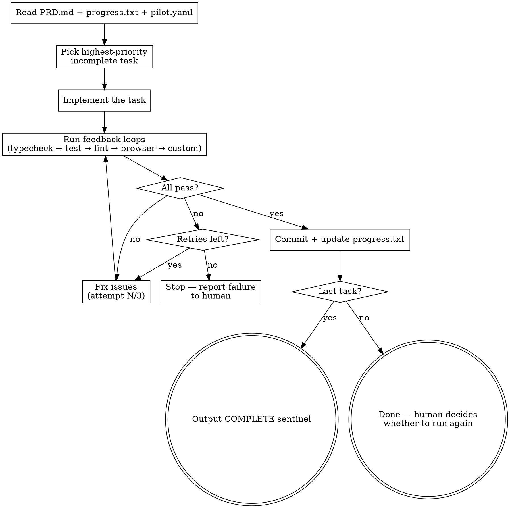

# PILOT Once — Execute One Task

Implement exactly one task from the PRD, validate with feedback loops, commit only if all pass.

**Announce at start:** "Running PILOT — picking the next task from PRD.md."

## Prerequisites

Before running, these files MUST exist:
- `PRD.md` — task backlog with checkboxes
- `.claude/pilot.yaml` — feedback loop config
- `progress.txt` — iteration log

If any are missing, tell the user: "Run `/pilot:plan` first to set up PILOT."

## The Loop



## Step-by-Step Execution

### 1. Read Context

Read these three files:
- `PRD.md` — find the first unchecked (`- [ ]`) task
- `progress.txt` — understand what's already been done, what decisions were made
- `.claude/pilot.yaml` — know which feedback loops to run and the quality bar

### 2. Pick One Task

Select the **first unchecked task** in the PRD. Do not skip ahead. Do not batch multiple tasks.

If the task has dependencies on incomplete tasks above it, note this and attempt it anyway — the feedback loops will catch real blockers.

### 3. Implement

Write the code to complete the task. Follow these rules:
- **Read before writing** — understand existing patterns before adding code
- **Follow the codebase style** — match indentation, naming, structure
- **Respect the quality bar** from `pilot.yaml` (prototype vs production vs library)
- **One logical change** — don't scope-creep into adjacent improvements

### 4. Run Feedback Loops

Run each configured feedback loop from `pilot.yaml` **in order**:

```bash
# Read commands from pilot.yaml, skip null entries
# Example:
tsc --noEmit           # typecheck
vitest run             # test
biome check .          # lint
npx playwright test    # browser (if configured)
# ...any custom commands
```

**Rules:**
- Run ALL configured loops, not just the ones you think are relevant
- A loop "passes" if the command exits with code 0
- Pre-existing failures that existed before your changes do NOT count as your failure — but note them

### 5. Handle Failures

If a feedback loop fails:
1. Read the error output carefully
2. Fix the issue in your code
3. Re-run the failing loop
4. Retry up to **3 times per loop**
5. If still failing after 3 attempts: **STOP**

When stopping on failure:
- Do NOT commit broken code
- Report exactly what failed and why
- Suggest what the human should look at
- Append a failure entry to progress.txt

### 6. Commit

Only after ALL feedback loops pass. Check `pilot.yaml` for `loop.output` mode:

**If `output: commit` (default):**

```bash
git add [specific files you changed] progress.txt PRD.md
git commit -m "[type]: [description of what this task accomplished]"
```

**If `output: pr`:**

```bash
git checkout -b pilot/task-[N]-[short-description]
git add [specific files you changed] progress.txt PRD.md
git commit -m "[type]: [description of what this task accomplished]"
git push -u origin pilot/task-[N]-[short-description]
gh pr create --title "[type]: [description]" --body "PILOT automated PR for PRD #[N]"
git checkout [original branch]
```

Use conventional commit types: `feat`, `fix`, `refactor`, `test`, `chore`, `docs`.

**Never use `git add .` or `git add -A`** — only add files you intentionally changed (plus progress.txt and PRD.md).

### 7. Update Progress

Keep entries concise. Sacrifice grammar for the sake of concision. This file helps future iterations skip exploration.

Append to `progress.txt`:

```markdown
## [N] — PRD #[N]: [Task description]
files: [list of files created/modified]
decisions: [key decisions, terse]
feedback: typecheck ✓ test ✓ lint ✓
commit: [short hash]
```

For failures:
```markdown
## [N] — PRD #[N]: [Task description]
status: FAILED — [which loop]
error: [concise error description]
attempted: [what you tried]
needs: [what the human should look at]
```

### 8. Commit Progress

Include `progress.txt` in the commit — it belongs in git history:

```bash
git add [changed files] progress.txt PRD.md
git commit -m "[type]: [description]"
```

### 10. Update PRD

Check off the completed task in PRD.md:
```markdown
- [x] **Task N:** [description]
```

### 11. Check Completion

If ALL tasks in the PRD are checked off, output exactly:
```
<promise>COMPLETE</promise>
```

Otherwise, report what was done and stop. The human (or afk-loop.sh) decides whether to continue.

## Red Flags — STOP and Reconsider

| Thought | Reality |
|---------|---------|
| "I'll do this task AND the next one" | One task per iteration. Context rot is real. |
| "The tests are close enough" | Feedback loops are pass/fail. No "close enough." |
| "I'll commit now and fix the test later" | No commit without green. This is non-negotiable. |
| "This pre-existing failure is blocking me" | Note it, work around it, or escalate. Don't ignore it. |
| "I'll skip the lint check, it's just style" | Run ALL configured loops. The config exists for a reason. |
| "Let me also refactor this nearby code" | One logical change. Stay on task. |
