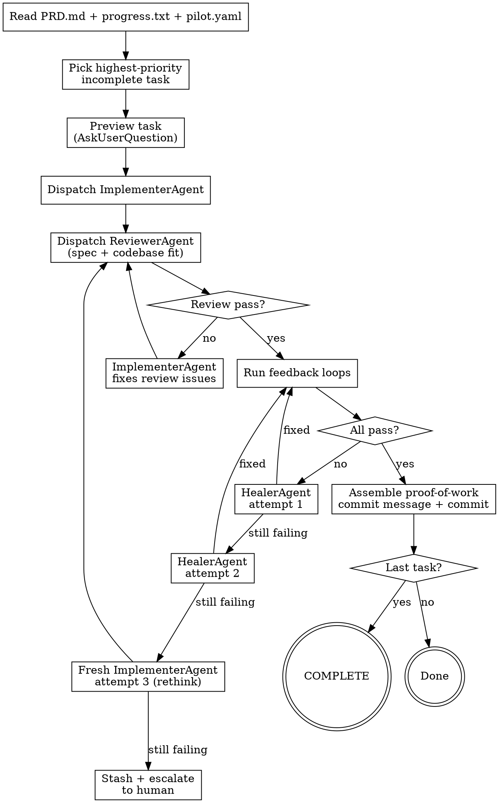

# PILOT Run — Execute One Task

Implement exactly one task from the PRD, validate with feedback loops, commit only if all pass.

**Announce at start:** "Running PILOT — picking the next task from PRD.md."

## Prerequisites

Before running, these files MUST exist:
- `PRD.md` — task backlog with checkboxes
- `.claude/pilot.yaml` — feedback loop config
- `progress.txt` — iteration log

If any are missing, tell the user: "Run `/pilot:plan` first to set up PILOT."

## Output Contract

This skill is the canonical execution contract for both manual mode and loop mode.

- Emit exactly one top-level result marker on its own line before finishing:
  - `PILOT_RESULT=done`
  - `PILOT_RESULT=failed`
  - `PILOT_RESULT=skipped`
  - `PILOT_RESULT=escalated`
- If the PRD is fully complete after this task, also emit exactly: `<promise>COMPLETE</promise>`
- Every Task-tool subagent response must include a rigid `===AGENT_OUTPUT===` block with valid JSON and no extra text inside the delimiters

## The Loop



## Step-by-Step Execution

### 1. Read Context

Read these three files:
- `PRD.md` — find the first unchecked (`- [ ]`) task
- `progress.txt` — understand what's already been done, what decisions were made
- `.claude/pilot.yaml` — know which feedback loops to run and the quality bar

### 2. Pick One Task

Select the **first unchecked task** in the PRD. Do not skip ahead. Do not batch multiple tasks.

If the task has a `Depends:` field referencing incomplete tasks, note this and attempt it anyway — the feedback loops will catch real blockers.

### 3. Preview Task

Present the picked task and use AskUserQuestion to confirm before implementing:

```json
{
  "questions": [{
    "question": "Next task: #[N] — [task description]\n  Acceptance: [criteria]\n  Validation: [feedback loops]\n  Files: [expected files]",
    "header": "Task",
    "options": [
      {"label": "Run this task", "description": "Proceed with implementation"},
      {"label": "Skip to next", "description": "Skip this task and pick the next unchecked one"},
      {"label": "Give guidance", "description": "I want to provide direction before you start"}
    ],
    "multiSelect": false
  }]
}
```

If the user selects "Skip to next", move to the next unchecked task and preview again. If they select "Give guidance", read their input and incorporate it into your approach.

### 4. Dispatch ImplementerAgent

Read `agents/implementer.md` for the full agent prompt. Dispatch it explicitly with the **Task tool** using `subagent_type: "general-purpose"`. Include in the prompt:
- The full agent prompt from `agents/implementer.md`
- The task (description, acceptance criteria, context hints, expected files)
- Codebase context from `pilot.yaml` `codebase:` section
- Quality bar from `pilot.yaml`

The ImplementerAgent states its approach, implements the code, writes tests, and self-reviews. Parse the `===AGENT_OUTPUT===` JSON block from its response. Expected shape:

```json
{
  "status": "implemented",
  "approach_summary": "what was done and which pattern/library was used",
  "alternatives_considered": ["alternative rejected and why"],
  "files_changed": ["path/to/file"],
  "tests_added_or_updated": ["path/to/test-file"],
  "self_review": "concerns or \"none\""
}
```

### 5. Dispatch ReviewerAgent

Read `agents/reviewer.md` for the full agent prompt. Dispatch it explicitly with the **Task tool** using `subagent_type: "general-purpose"`. Include in the prompt:
- The full agent prompt from `agents/reviewer.md`
- The diff from ImplementerAgent
- The task's acceptance criteria and context
- Codebase context from `pilot.yaml`

The ReviewerAgent checks spec compliance and codebase fit. Parse the `===AGENT_OUTPUT===` JSON block from its response. Expected shape:

```json
{
  "spec_compliance": "pass",
  "codebase_fit": "pass",
  "issues": [],
  "findings_summary": "spec pass, codebase-fit pass"
}
```

Each `issues` entry must be an object with `severity`, `file`, `line`, and `summary`. If issues are found:
1. Send issues back to ImplementerAgent for fixes (dispatch via Task tool again)
2. ReviewerAgent re-reviews
3. Max 2 review rounds — then proceed to feedback loops regardless

Store the ReviewerAgent's **findings_summary** for the commit message.

### 6. Run Feedback Loops

Run each configured feedback loop from `pilot.yaml` **in order**:

```bash
# Read commands from pilot.yaml, skip null entries
tsc --noEmit           # typecheck
vitest run             # test
biome check .          # lint
npx playwright test    # browser (if configured)
# ...any custom commands
```

**Rules:**
- Run ALL configured loops, not just the ones you think are relevant
- A loop "passes" if the command exits with code 0
- Pre-existing failures that existed before your changes do NOT count as your failure — but note them

### 7. Handle Failures — Heal → Rethink → Escalate

If a feedback loop fails, use the smart escalation chain:

**Attempt 1 — HealerAgent targeted fix:**
Read `agents/healer.md`. Dispatch it explicitly with the **Task tool** using `subagent_type: "general-purpose"`. Include the full agent prompt, error output, diff, acceptance criteria, and codebase context. Parse the `===AGENT_OUTPUT===` JSON block. Expected shape:

```json
{
  "status": "fixed",
  "diagnosis": "what went wrong and why",
  "fix_summary": "what changed to address it",
  "files_changed": ["path/to/file"],
  "confidence": "high"
}
```

Re-run the failing feedback loop.

**Attempt 2 — HealerAgent different approach:**
If attempt 1 didn't fix it, dispatch HealerAgent again via **Task tool** with attempt number 2. It tries a different fix strategy. Re-run the failing feedback loop.

**Attempt 3 — Fresh ImplementerAgent rethink:**
If HealerAgent couldn't fix it, dispatch a **fresh** ImplementerAgent via **Task tool** with failure context: "Attempts 1-2 tried X and Y. Both failed because Z. Try a different approach entirely." The fresh ImplementerAgent rethinks from scratch, then goes through ReviewerAgent and feedback loops again.

**After attempt 3 — Escalate to human:**
- Do NOT commit broken code
- **Stash the failed attempt**: `git stash push -m "pilot/failed-task-[N]: [description]"`
- Report what failed, what was tried, what the human should look at
- Append failure entry to progress.txt

### 8. Commit with Proof of Work

Only after ALL feedback loops pass. Assemble the commit message from the parsed `===AGENT_OUTPUT===` JSON returned by each agent:

```
[type]: [short description]

PILOT Task #[N] — [task description]
Acceptance: [criteria] ✓

Approach: [from ImplementerAgent.approach_summary]
Considered: [from ImplementerAgent.alternatives_considered]

Files: [N] changed, +[added]/-[removed]
  [file1] (new|modified)
  [file2] (new|modified)

Feedback: typecheck ✓  test ✓  lint ✓
Reviewed: [from ReviewerAgent.findings_summary]
```

With `--verbose` or `observability.verbosity: medium`, include detailed reviewer findings in the `Reviewed:` line.

Check `pilot.yaml` for `loop.output` mode:

**If `output: commit` (default):**
```bash
git add [specific files] progress.txt PRD.md
git commit -m "[proof of work message]"
```

**If `output: pr`:**
```bash
git checkout -b pilot/task-[N]-[short-description]
git add [specific files] progress.txt PRD.md
git commit -m "[proof of work message]"
git push -u origin pilot/task-[N]-[short-description]
gh pr create --title "[type]: [description]" --body "PILOT automated PR for PRD #[N]"
git checkout [original branch]
```

Use conventional commit types: `feat`, `fix`, `refactor`, `test`, `chore`, `docs`.

**Never use `git add .` or `git add -A`** — only add files you intentionally changed (plus progress.txt and PRD.md).

### 9. Update Progress

Keep entries concise. Sacrifice grammar for the sake of concision. This file helps future iterations skip exploration.

Check `observability.verbosity` in `pilot.yaml` (or `--verbose` flag in loop mode):
- **`light`** (default) — `decisions:` is a one-liner: key choice + reason
- **`medium`** — `decisions:` is 2-3 sentences: what was considered, what was chosen, why

Append to `progress.txt`:

```markdown
## [N] — PRD #[N]: [Task description]
time: YYYY-MM-DD HH:MM
files: [list of files created/modified]
decisions: [key decisions, terse]
feedback: typecheck ✓ test ✓ lint ✓
commit: [short hash]
```

For failures:
```markdown
## [N] — PRD #[N]: [Task description]
time: YYYY-MM-DD HH:MM
status: FAILED — [which loop]
approach: [what ImplementerAgent tried]
healer: [attempt 1 diagnosis], [attempt 2 diagnosis]
rethink: [attempt 3 approach, if reached]
error: [final error]
needs: [what the human should look at]
stash: pilot/failed-task-[N]: [description]
```

### 10. Update PRD

Check off the completed task in PRD.md:
```markdown
- [x] **Task N:** [description]
```

### 11. Check Completion

Before finishing, emit exactly one top-level result marker:

- `PILOT_RESULT=done` when one task completed successfully
- `PILOT_RESULT=skipped` when nothing was changed intentionally for this iteration
- `PILOT_RESULT=escalated` when the task had to be handed to a human after bounded retries or guardrail blocking
- `PILOT_RESULT=failed` when the run itself failed before reaching a stable task outcome

If ALL tasks in the PRD are checked off after a successful task, also output exactly:
```
<promise>COMPLETE</promise>
```

Otherwise, report what was done and stop. The human or `pilot-loop.sh` decides whether to continue.

## Red Flags — STOP and Reconsider

| Thought | Reality |
|---------|---------|
| "I'll do this task AND the next one" | One task per iteration. Context rot is real. |
| "The tests are close enough" | Feedback loops are pass/fail. No "close enough." |
| "I'll commit now and fix the test later" | No commit without green. This is non-negotiable. |
| "This pre-existing failure is blocking me" | Note it, work around it, or escalate. Don't ignore it. |
| "I'll skip the lint check, it's just style" | Run ALL configured loops. The config exists for a reason. |
| "Let me also refactor this nearby code" | One logical change. Stay on task. |
